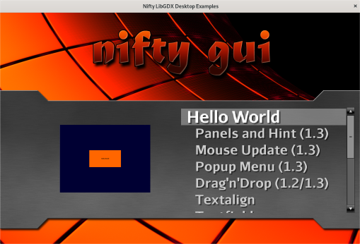

# Nifty GUI




Nifty is available in the Maven central:

```XML
<groupId>com.github.nifty-gui</groupId>
<artifactId>nifty</artifactId>
<version>1.4.3</version>
```

To use SNAPSHOT builds of Nifty you'll still need to add the Sonatype snapshots repositories to your pom.xml.

```XML
  <repositories>
    <!-- only needed for snapshot builds starting with 1.4.4-SNAPSHOT -->
    <repository>
      <id>ossrh</id>
      <url>https://oss.sonatype.org/content/repositories/snapshots/</url>
    </repository>
  </repositories>
```

